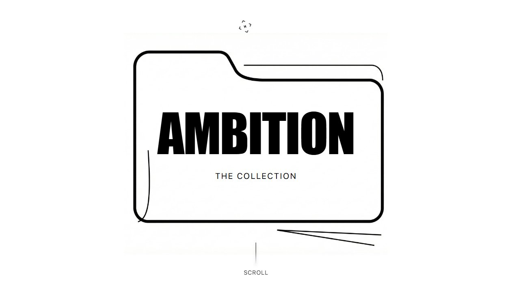
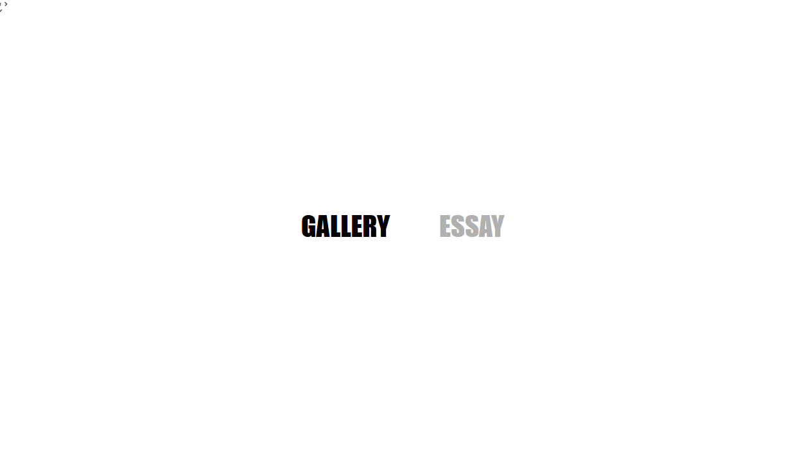
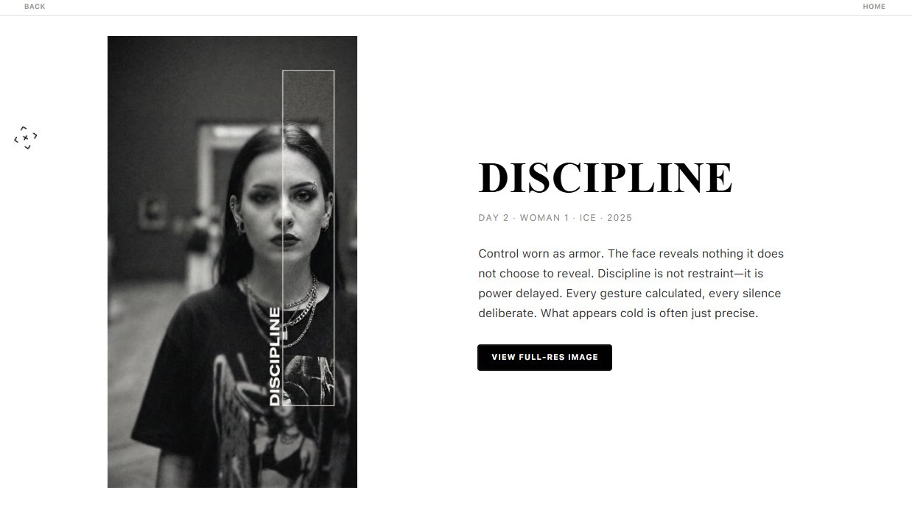
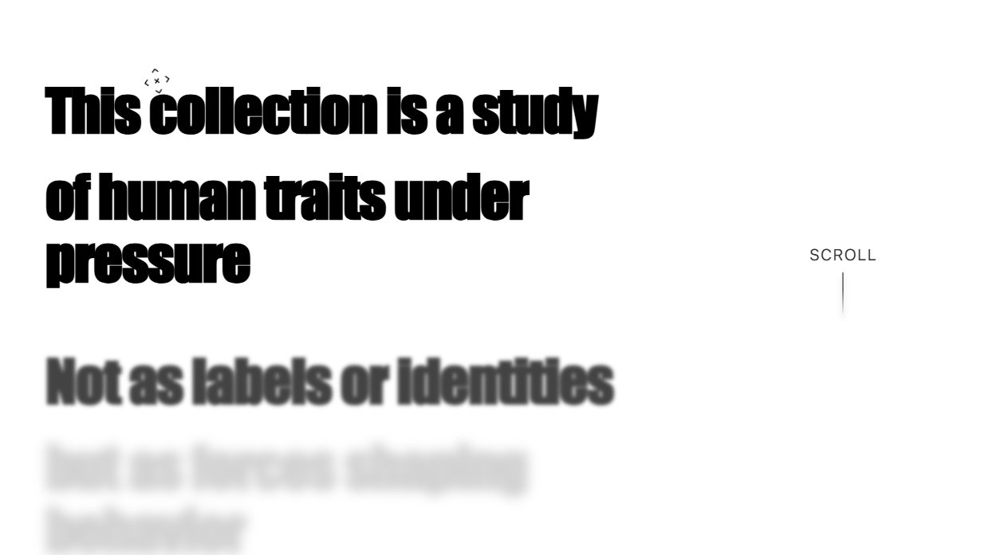

# AMBITION

## → https://ambition-collection.vercel.app/

A minimalist digital exhibition exploring the human psyche through form, restraint, and visual tension.

Built as a cinematic web experience, the site favors atmosphere over noise. Bold typography, controlled motion, and stark black and white composition guide the viewer through a curated collection rather than a traditional gallery.

---

## Preview

---

## TL;DR

- Digital art collection presented as an immersive web exhibit  
- Masonry gallery with structured asymmetry  
- Editorial essay with progressive text reveal  
- Cinematic transitions across sections  
- Mobile-first gesture support  
- Zero visual clutter. Pure focus on the work.

Open the collection. Move slowly. Let the pieces speak.

# AMBITION  
### A Visual Essay on the Human Psyche

AMBITION is a conceptual, black-and-white web experience that explores human traits through repetition, structure, and restraint.  
It is not a product site. It is not a portfolio.  
It is an editorial system designed to be read, navigated, and felt.

---

## Concept

The collection presents a series of portraits that all share the same visual framework.  
What changes is not the structure, but the person within it.

Each artwork is labeled with a single word.  
These words are not meant as identities or diagnoses.  
They represent pressures we live under.

The site itself mirrors this philosophy:
- Repetition over novelty
- Silence over explanation
- Structure over decoration

---

## Project Structure

The project is organized as a small, deliberate set of routes rather than a traditional multi-page site.

### Core Routes

- `/`  
  Hero / cover page introducing the collection

- `/list`  
  Gallery index presented as an editorial archive  
  Supports both List and Grid views

- `/essay`  
  A text-only visual essay explaining the thinking behind the work

- `/{artwork}`  
  Individual artwork pages  
  Example: `/ambition`, `/fractured`, etc.

> File extensions are intentionally hidden.  
> Routes are clean and conceptual.

---

## Pages Overview

### 1. Hero (Cover)

- Abstract folder / collection motif built from thin line segments
- Large editorial title: **AMBITION**
- Subtitle: *The collection*
- Minimal scroll indicator
- No navigation, no distractions

Purpose:  
To set tone, not to explain.

---

### 2. Choice Page (Gallery / Essay)

- Two large words only:
  - **GALLERY**
  - **ESSAY**
- Hovering one emphasizes it while muting the other
- No scrolling past this point
- Scroll back returns to hero

Purpose:  
To introduce intention before content.

---

### 3. Gallery Index (`/list`)

#### Header
- Intro text:  
  *A visual essay on the Human Psyche*

- Mode toggle:
  - **GALLERY** (active)
  - **ESSAY** (inactive, navigates to essay)

- View toggle:
  - GRID
  - LIST

---

#### List View

- Editorial archive layout
- No visible column headers
- Fields per entry:
  - Thumbnail image
  - Day (Day 1, Day 2, etc)
  - Title (e.g. `ambition (man 1)`)
  - Artist (`ICE`)
  - Year (`2025`)

- Rendered as 5 rows
- Entries 6–10 appear side-by-side with 1–5
- The 11th entry is centered beneath and visually emphasized

Purpose:  
To feel like a catalog, not a feed.

---

#### Grid View

- Structured layout:  
  `3 – 3 – 4 – 1` (11 total works)

- Edge-to-edge rows  
- No gaps at page edges
- Tight spacing between items
- Thumbnails are slightly zoomed in as previews
- Extra spacing at the bottom for visual rest

Purpose:  
To present the collection as a whole object.

---

### 4. Essay Page (`/essay`)

- Text-only page
- Large, bold editorial typography
- Maximum of 5–6 words per line
- Left-aligned text

#### Layout
- Page split into four vertical columns
- Left columns: text
- Rightmost column: reserved visual space  
  (`essay-visual-slot`)

#### Interaction
- Scrolling does not move the page traditionally
- Scroll input reveals text gradually:
  - Top lines are sharp and fully opaque
  - Lower lines fade and blur into absence

- A scroll indicator appears in the right column
- Once scrolling begins, the indicator fades out
- At the end of the essay:
  - A vertical list of artworks with thumbnails appears
  - Clicking navigates to artwork pages
  - A GALLERY / ESSAY toggle fades in

Purpose:  
To turn reading into an intentional act.

---

### 5. Artwork Pages (`/{artwork}`)

- Full-page display of the selected artwork
- The image is primary
- A short, bold editorial paragraph accompanies it
- The top strip remains visible for continuity

Purpose:  
To isolate and focus on a single piece without breaking the system.

---

## Transitions & Motion

All navigation and section changes use the same transition language:

- Soft fade-out
- Brief blur at midpoint
- Smooth fade-in

No sliding.  
No snapping.  
No playful motion.

Motion is used to maintain continuity, not excitement.

---

## Design Constraints

These rules are non-negotiable:

- Black, white, and gray only
- No color accents
- No gradients
- No icons unless abstract and structural
- No decorative elements
- No explanatory copy outside the essay

Typography is bold, editorial, and restrained.

---

## Technology Notes

The project is designed to be implemented with modern frontend tools (React-based), but the core value of the work is **conceptual and structural**, not technical.

The README intentionally documents:
- Intent
- Behavior
- Visual logic

rather than framework-specific setup.

---

## Credits

- **Artist / Concept**: ICE  
- **Year**: 2025  
- **Format**: Web-based visual essay

---

## License / Usage

This project is a conceptual art work.

Do not reuse the images, text, or structure for commercial templates without permission.  
Forking for learning or reference is acceptable with attribution.

---

## Final Note

If this project feels slow, quiet, or uncomfortable at times,  
that is intentional.

The site is not meant to be consumed quickly.  
It is meant to be entered, paused in, and left with.

